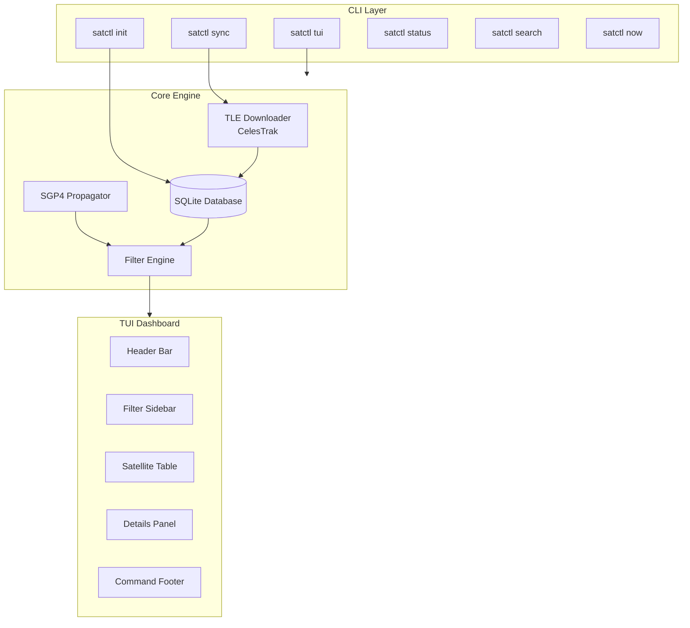
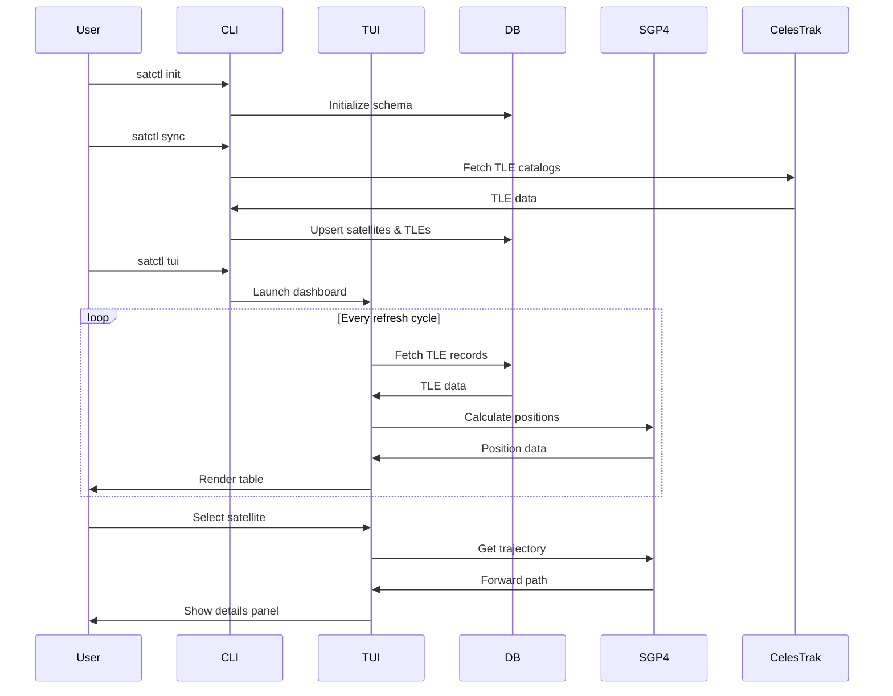

# satctl Architecture Specification

**Version:** 1.0  
**Date:** 2026-03-04  
**Status:** Draft for Review

---

## 1. Project Overview

satctl is a terminal-native satellite OSINT CLI tool that provides real-time satellite tracking and analysis through an interactive btop-style TUI interface. The entire experience occurs within the terminal with local data processing.

### Key Characteristics

- **Terminal-first**: No web interfaces, pure CLI/TUI experience
- **Local processing**: All satellite calculations performed locally
- **Open data**: Uses public CelesTrak TLE catalogs
- **OSINT focus**: Designed for investigation workflows

---

## 2. Technology Stack

| Component | Technology | Rationale |
|-----------|------------|-----------|
| Language | Python 3.11+ | Rapid development, rich ecosystem |
| TUI Framework | Textual | Modern, declarative, btop-like styling |
| SGP4 Library | `sgp4` | Standard Python SGP4 implementation |
| Database | SQLite + SQLAlchemy | Local storage, efficient queries |
| CLI Framework | Click | Simple, composable CLI commands |
| HTTP Client | `httpx` | Async HTTP for TLE downloads |
| Date/Time | `datetime`, `zoneinfo` | UTC handling |

### Dependencies (pyproject.toml)

```
[project]
name = "satctl"
version = "0.1.0"
requires-python = ">=3.11"
dependencies = [
    "click>=8.1.0",
    "textual>=0.50.0",
    "sgp4>=2.23",
    "sqlalchemy>=2.0.0",
    "httpx>=0.25.0",
    "geographiclib>=2.0",
    "numpy>=1.24.0",
]

[project.scripts]
satctl = "satctl.cli:main"
```

---

## 3. System Architecture



---

## 4. Module Design

### 4.1 Project Structure

```
satctl/
├── satctl/
│   ├── __init__.py
│   ├── __main__.py
│   ├── cli.py              # CLI entry point
│   ├── config.py           # Configuration management
│   ├── database/
│   │   ├── __init__.py
│   │   ├── models.py       # SQLAlchemy models
│   │   ├── schema.py       # Database schema
│   │   └── repository.py   # Data access layer
│   ├── sync/
│   │   ├── __init__.py
│   │   ├── celestrak.py    # CelesTrak client
│   │   └── tle_parser.py   # TLE parsing
│   ├── propagation/
│   │   ├── __init__.py
│   │   ├── sgp4_engine.py  # SGP4 wrapper
│   │   └── utils.py        # Coordinate utilities
│   ├── tui/
│   │   ├── __init__.py
│   │   ├── app.py          # Main TUI app
│   │   ├── screens/
│   │   │   ├── __init__.py
│   │   │   └── dashboard.py
│   │   └── widgets/
│   │       ├── __init__.py
│   │       ├── header.py
│   │       ├── sidebar.py
│   │       ├── table.py
│   │       └── details.py
│   └── utils/
│       ├── __init__.py
│       └── logging.py
├── tests/
│   ├── __init__.py
│   ├── test_sgp4.py
│   ├── test_sync.py
│   └── test_tui.py
├── pyproject.toml
├── README.md
├── LICENSE
├── CONTRIBUTING.md
└── ARCHITECTURE.md
```

### 4.2 Module Responsibilities

#### `satctl.cli`

Entry point for all CLI commands using Click.

```python
# Commands structure
satctl init      # Create directories and database
satctl sync      # Download latest TLE data
satctl tui       # Launch interactive dashboard
satctl status    # Show catalog info
satctl search    # Search satellites
satctl now       # Show single satellite position
```

#### `satctl.database`

SQLAlchemy-based data layer.

**Tables:**

```sql
-- satellite table
CREATE TABLE satellite (
    norad_id INTEGER PRIMARY KEY,
    name TEXT NOT NULL,
    source TEXT,
    updated_at TIMESTAMP DEFAULT CURRENT_TIMESTAMP
);

-- tle table
CREATE TABLE tle (
    id INTEGER PRIMARY KEY AUTOINCREMENT,
    norad_id INTEGER REFERENCES satellite(norad_id),
    epoch DATETIME NOT NULL,
    line1 TEXT NOT NULL,
    line2 TEXT NOT NULL,
    fetched_at TIMESTAMP DEFAULT CURRENT_TIMESTAMP
);

CREATE INDEX idx_tle_norad ON tle(norad_id);
CREATE INDEX idx_tle_epoch ON tle(epoch);
```

#### `satctl.sync`

Downloads TLE data from CelesTrak.

**Catalogs to sync:**
- `https://celestrak.org/NORAD/elements/gp.php?GROUP=active&FORMAT=tle`
- `https://celestrak.org/NORAD/elements/gp.php?GROUP=analyst&FORMAT=tle`
- `https://celestrak.org/NORAD/elements/gp.php?GROUP=1999-025&FORMAT=tle`
- `https://celestrak.org/NORAD/elements/gp.php?GROUP=visual&FORMAT=tle`
- `https://celestrak.org/NORAD/elements/gp.php?GROUP=one-line&FORMAT=tle`
- `https://celestrak.org/NORAD/elements/gp.php?GROUP=tl&FORMAT=tle`

#### `satctl.propagation`

SGP4 position calculation.

```python
@dataclass
class SatellitePosition:
    norad_id: int
    name: str
    latitude: float      # degrees
    longitude: float     # degrees
    altitude: float      # km
    timestamp: datetime
    tle_age: float       # days since epoch
    orbital_class: str  # LEO/MEO/GEO estimation
```

#### `satctl.tui`

Textual-based interactive dashboard.

**Layout (btop-style):**

```
┌────────────────────────────────────────────────────────────┐
│ satctl v0.1 | UTC 21:44:02 | Catalog 12431 | Sync 3h ago   │
├──────────────┬─────────────────────────────┬───────────────┤
│ Filters      │ Live Satellite Table        │ Details       │
│              │                             │               │
│ Group: [All] │ ID   Name   Lat   Lon Alt   │ Satellite     │
│ Orbit: [All] │                             │ info panel    │
│ Region: GLOB │ scrolling table             │               │
│ Search: [  ] │                             │ TLE age       │
│ Limit: [500] │                             │ mini track    │
│              │                             │               │
├────────────────────────────────────────────────────────────┤
│ q quit | r refresh | s sync | / search | g group | ? help  │
└────────────────────────────────────────────────────────────┘
```

---

## 5. Data Flow



---

## 6. Region Modes

### 6.1 Global Mode

Display all satellites in the catalog without geographic filtering.

### 6.2 Bounding Box Mode

Filter satellites within a coordinate rectangle:

```
min_lat <= latitude <= max_lat
min_lon <= longitude <= max_lon
```

### 6.3 Radius Mode

Filter satellites within a distance from a point:

```
distance(center, satellite_position) <= radius
```

Using geodesic distance formula for accurate Earth surface measurement.

---

## 7. CLI Command Specifications

### 7.1 `satctl init`

```bash
satctl init [--force]
```

Creates:
- `~/.local/share/satctl/` directory
- `~/.local/share/satctl/satctl.db` SQLite database
- Default configuration file

### 7.2 `satctl sync`

```bash
satctl sync [--catalogs active,analyst,visual]
```

Downloads TLE data from CelesTrak and updates local database.

### 7.3 `satctl tui`

```bash
satctl tui [--refresh 1.5] [--group active] [--limit 200]
```

Launches interactive dashboard with optional parameters.

### 7.4 `satctl status`

```bash
satctl status
```

Output:
```
satctl v0.1.0
Catalog: 12,431 satellites
Last sync: 2026-03-04 14:22:00 UTC
Data age: 3 hours, 11 minutes
Database: ~/.local/share/satctl/satctl.db
```

### 7.5 `satctl search`

```bash
satctl search "starlink" [--limit 50]
```

Output:
```
 NORAD ID │ Name                          │ Epoch
──────────┼────────────────────────────────┼──────────────
 25544    │ ISS (ZARYA)                   │ 2026-03-03
 47401    │ Starlink 1001                 │ 2026-03-04
 47402    │ Starlink 1002                 │ 2026-03-04
  ...
```

### 7.6 `satctl now`

```bash
satctl now --id 25544
```

Output:
```
ISS (ZARYA) - NORAD 25544
─────────────────────────
Position (2026-03-04 21:44:02 UTC):
  Latitude:  34.5213°
  Longitude: -12.4891°
  Altitude:  420.3 km

Orbital:
  Class: LEO
  TLE Age: 0.8 days
```

---

## 8. TUI Keybindings

| Key | Action |
|-----|--------|
| `q` | Quit |
| `r` | Refresh positions |
| `s` | Sync catalog |
| `/` | Focus search |
| `g` | Cycle group filter |
| `o` | Cycle orbit filter |
| `m` | Cycle region mode |
| `Enter` | Select satellite (show details) |
| `Esc` | Clear selection |
| `?` | Show help |
| `↑/↓` | Navigate table |
| `PageUp/Down` | Fast scroll |

---

## 9. Performance Considerations

### 9.1 Target Metrics

| Operation | Target Latency |
|-----------|---------------|
| TUI refresh | ≤ 2 seconds |
| Table render | ≤ 200 ms |
| Catalog sync | ≤ 5 seconds |
| Single position | ≤ 50 ms |

### 9.2 Optimization Strategies

1. **Batch SGP4 calculations**: Process satellites in batches using NumPy vectorization where possible
2. **Cache TLE data**: Keep latest TLE data in memory during TUI session
3. **Lazy loading**: Load satellite details only when selected
4. **Index optimization**: Ensure database indexes on frequently queried columns
5. **Async I/O**: Use async/await for HTTP requests during sync
6. **Connection pooling**: Reuse database connections

---

## 10. Error Handling

### 10.1 Network Errors

- Retry with exponential backoff (3 attempts)
- Show clear error message if CelesTrak unreachable
- Allow offline mode (use cached data)

### 10.2 Database Errors

- Auto-create database on first run
- Validate TLE data before insertion
- Handle corrupt database gracefully

### 10.3 SGP4 Errors

- Skip satellites with invalid TLE data
- Log warnings for calculation failures
- Continue processing remaining satellites

---

## 11. Future Considerations (Post-v0.1)

- **Orbital pass predictions**: Calculate rise/set times for locations
- **Ground track visualization**: ASCII art ground tracks in details panel
- **Alerting**: Notify when satellites enter specific regions
- **History tracking**: Store position history for analysis
- **Multiple data sources**: Support additional TLE sources beyond CelesTrak

---

## 12. Implementation Checklist

- [ ] Project scaffolding and pyproject.toml
- [ ] Database models and schema
- [ ] CelesTrak sync module
- [ ] SGP4 propagation engine
- [ ] CLI commands (init, sync, status, search, now)
- [ ] TUI app structure
- [ ] Header widget
- [ ] Filter sidebar
- [ ] Satellite table
- [ ] Details panel
- [ ] Footer with keybindings
- [ ] Region modes (Global, BBox, Radius)
- [ ] Satellite inspector
- [ ] Performance optimization
- [ ] README and documentation
- [ ] LICENSE (MIT)
- [ ] CONTRIBUTING guide

---

**End of Architecture Specification**
